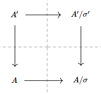

\\[\newcommand{\bA}{\mathbb{A}}
\newcommand{\bR}{\mathbb{R}}
\newcommand{\bC}{\mathbb{C}}
\newcommand{\bD}{\mathbb{D}}
\newcommand{\bF}{\mathbb{F}}
\newcommand{\bG}{\mathbb{G}}
\newcommand{\bH}{\mathbb{H}}
\newcommand{\bN}{\mathbb{N}}
\newcommand{\bP}{\mathbb{P}}
\newcommand{\bQ}{\mathbb{Q}}
\newcommand{\bT}{\mathbb{T}}
\newcommand{\bU}{\mathbb{U}}
\newcommand{\bZ}{\mathbb{Z}}
\newcommand{\cA}{\mathcal{A}}
\newcommand{\cB}{\mathcal{B}}
\newcommand{\cC}{\mathcal{C}}
\newcommand{\cD}{\mathcal{D}}
\newcommand{\cE}{\mathcal{E}}
\newcommand{\cF}{\mathcal{F}}
\newcommand{\cG}{\mathcal{G}}
\newcommand{\cH}{\mathcal{H}}
\newcommand{\cHom}{\mathcal{H}om}
\newcommand{\cI}{\mathcal{I}}
\newcommand{\cJ}{\mathcal{J}}
\newcommand{\cK}{\mathcal{K}}
\newcommand{\cL}{\mathcal{L}}
\newcommand{\cM}{\mathcal{M}}
\newcommand{\cN}{\mathcal{N}}
\newcommand{\cP}{\mathcal{P}}
\newcommand{\cT}{\mathcal{T}}
\newcommand{\cU}{\mathcal{U}}
\newcommand{\cX}{\mathcal{X}}
\newcommand{\fa}{\mathfrak{a}}
\newcommand{\fd}{\mathfrak{d}}
\newcommand{\fm}{\mathfrak{m}}
\newcommand{\fn}{\mathfrak{n}}
\newcommand{\fp}{\mathfrak{p}}
\newcommand{\fq}{\mathfrak{q}}
\newcommand{\Bl}{\text{Bl}}
\newcommand{\Id}{\text{Id}}
\newcommand{\rProj}{\underline\mathrm{Proj}\,}
\newcommand{\Spec}{\mathrm{Spec}\,}\\]

# This is not complete.

# Before start

I try to write some pictures what is happening instead of writing a bunch of proof. I am (really) bad at English. Some sentences are not clear and there might be grammar issue. I didn't make 'comment' section. I will write my contact info later.

Note that there are no posts with title $K3$ surfaces (1) or (2). I might add them later or fix this title.

In here, we construct some surfaces and see how it works (starting from checking $K3$...)

# Convention

We work on arbitrary field $k$ (not necessarily algebraically closed field) whose characteristic is **not** $2$.

Point means closed point. Otherwise I will indicate the type of point (for example: generic point,...)

# Start

## A construction

### 1 

(Several remarks)

An **abelian surface** is an **abelian variety** of dimension $2$. In detail it is a variety of dimension $2$ that satisfies equivalent statement

- A connected and complete algebraic group over $k$.
- A connected and projective algebraic group over $k$.

(Taken from [1] page 8. I'm totally new with this so... I hope it is a good reference)

Let $X$ be a variety over $\overline{k}$ (algebraic closure of $k$) if $\Spec \widehat{O_{X,p}}$ is isomorphic to the completion of the curve $\Spec \overline{k}[x,y]/(f(x,y))$ where $f$ is a homogeneous polynomial of degree $m$ without repeated roots, we say $X$ has an **ordinary multiple point of multiplicity** $m$. When $m=2$, we say $X$ has a (**ordinary**) **double point** at $p$. 

### 2

We construct new surface. Let $A$ be an abelian surface with **involution** $\sigma:A\rightarrow A$ (meaning $\sigma \circ \sigma = -\Id$) defined as multiplication by $-1$. Write 
\\[A^\sigma:=\{x\in A\mid \sigma(x)=x\}\cong A[2] \\] 
(The last set means the set of $2$-torsion points). It is known that there are $16$ rational double points.

One can think $A=\bC^2/\Gamma$ as an example where $\Gamma$ is a lattice of $\bC^2$. It is known as complex torus.

Note that we can consider $A[2]$ as a closed subvariety of $A$ and construct $A'=\Bl_{A[2]}A$. From canonical map $A\rightarrow A/\sigma$ (sending $a\in A$ to its equivalence class), we construct morphism
\\[A'\rightarrow A'/\sigma'\\]
with universal property of blowup.

Overall, we have this commutative diagram

Because there are $16$ double points, there are $16$ **exceptional curves** (meaning curve $C$ such that $C^2:=C\cdot C=-1$).

*I might make a post about blowup.*

## Properties

Let $S:=A'/\sigma'$ for emphasizing it is a surface.

### 1

With this construction, we claim $S$ is a $K3$ surface. I divided it in steps.

#### $S$ is smooth

Note that $S$ is smooth at everywhere except exceptional divisors. A good news is, we don't have to check smoothness at every $16$ curves. For $a\in A[2]$, let $\tau_a:A\rightarrow A$ be a translation by $a$ (sending $x$ to $x+a$). It is easy to check 
\\[\tau_a\circ \sigma=\sigma\circ\tau_a:A\rightarrow A.\\]
This implies the $16$ curves translate each other (with suitable element $a'\in A'$) and we only have to check  Note that we have very trivial point $0\in A$.

We assume $U=\Spec k[x,y]/I$ for some ideal $I$ of $k[x,y]$. Our claim is there is a local coordinate on $S$. Quic calculation gives \\[\Bl_0(A)=V(xv'-yu')\subset \bA^2\times \bP^1\\]
where $u',v'$ are local coordinate of $\bP^1$. On complement of $V(u')$, we write $u:=u'/v'$. Then we have local coordinate $y,u$ on $A'$. Note that $\sigma'$ acts as
\\[\sigma'(y)=-y,\quad\sigma'(u)=\sigma'(x/y)=x/y=u.\\]
This shows the local coordinate of $S$ is given as $y^2$ and $u$. This proves $S$ is smooth.

#### $S$ is $K3$ surface

(For those who don't know $K3$ surface. I divided in steps. One need to show $S$ is connected smooth proper surface (variety of dimension $2$) that satisfies following these)

##### $\omega_S:=\wedge^2 \Omega_S=O_S$

(I need to add theorem but I will do this in another post. Taken from \[3\] page 9).

**I don't know how to end this. I need some statements... until then it is not finished... However it is true. See \[3\] page 9**

Given exceptional curves $E_i$ and a morphism $\pi:A'\rightarrow S$ from the diagram, we have 
\\[\omega_{A'}\cong O(\sum E_i),\\]
(see \[2\] Proposition V.3.3 and use [tangent sheaf of abelian variety is trivial](https://mathoverflow.net/questions/73824/abelian-variety-and-tangent-bundle-reference-request)) and
\\[\omega_{A'}\cong \pi^*\omega_{S}\otimes O(\sum_i E_i)\\]
(I can't find references of these statements. Both are true by the way if \[3\] isn't wrong. If I have time I might inroduce proof of them)

Then we have $\pi^*\omega_{S}=O_{A'}$. 

Let $E^s_i$ be the image of $E_i$ in $S$. Then $\pi^*O(E^s_i)=O(2E_i)$ and we can write\\[\pi_*O_{A'}=O_X\opluss \cL^\vee\\]
where $\cL$ is a line bundle satisfies $\cL\otimes \cL=O(\sum_i E^s_i)$.

# Reference

I don't want to write references in formal way. To clarify, I added link.

\[1\]: J. S. Milne, Abelian Varieties ([link](https://www.jmilne.org/math/CourseNotes/av.html)).

\[2\]: R. Hartshonre, Algebraic Geometry ([link](https://link.springer.com/book/10.1007/978-1-4757-3849-0)).

\[3\]: D. Huybrechts, Lectures on K3 surfaces ([link](https://www.math.uni-bonn.de/people/huybrech/K3Global.pdf)).